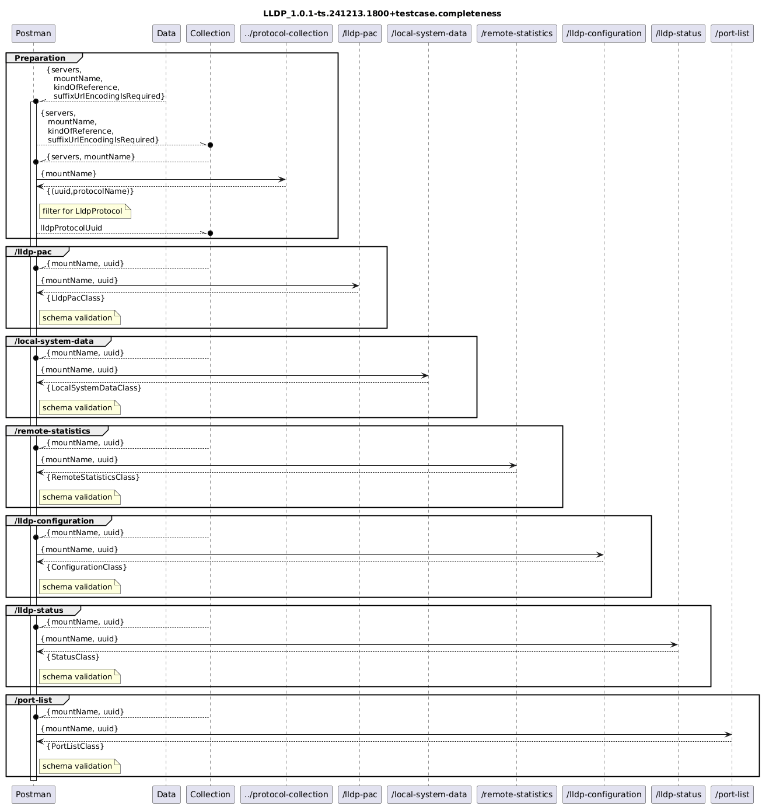

# LLDP_1.0.1-ts.241213.1800+validator

### Completeness
- [LLDP_1.0.1-ts.241213.1800+validator.completeness](./Completeness/LLDP_1.0.1-ts.241213.1800+validator.completeness.json)  
- [LLDP_1.0.1-ts.241213.1800+data.completeness](./Completeness/LLDP_1.0.1-ts.241213.1800+data.completeness.json)  
-   